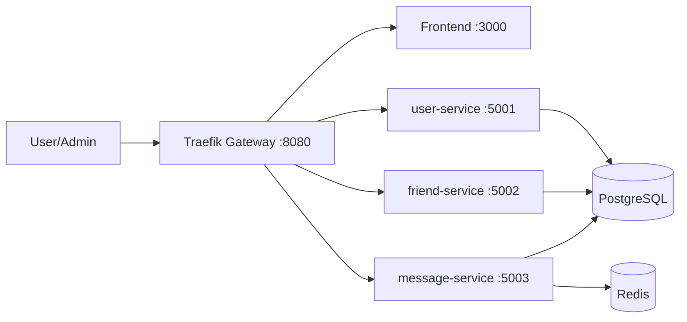

# ChatApp Microservice

[](https://github.com/hungdn1701/microservices-assignment-starter/stargazers)
[](https://github.com/hungdn1701/microservices-assignment-starter/network/members)
[](LICENSE)

> Nền tảng chat 1-1 theo kiến trúc microservice với JWT auth, luồng kết bạn, nhắn tin real-time và kiểm duyệt nội dung bằng danh sách từ khóa cấm.

> **New to this repo?** See [`GETTING_STARTED.md`](GETTING_STARTED.md) for setup instructions, workflow guide, and submission checklist.

---

## Team Members

| Name                | Student ID | Role     | Contribution                       |
| ------------------- | ---------- | -------- | ---------------------------------- |
| Nguyễn Quang Minh   | B22DCCN538 | DevOps   | Message services, Deployment       |
| Nguyễn Hoàng Hiệp   | B22DCCN298 | Backend  | Bootstrap project, Friend services |
| Đặng Hữu Hoàng Quân | B22DCCN658 | Frontend | Frontend, User services            |

---

## Business Process

Hệ thống tự động hóa quy trình: người dùng đăng ký/đăng nhập, gửi và xử lý lời mời kết bạn, sau đó nhắn tin 1-1 real-time. Admin quản lý từ khóa cấm để lọc nội dung tin nhắn. Tất cả client traffic đi qua API Gateway (Traefik) trước khi đến từng service.

---

## Architecture



| Component     | Responsibility | Tech Stack | Port |
| ------------- | -------------- | ---------- | ---- |
| **Frontend** | SPA cho đăng nhập, kết bạn, chat real-time, trang API docs | React 18 + Vite + Tailwind + Caddy | 3000 |
| **Gateway** | Reverse proxy, định tuyến API/WebSocket, service discovery | Traefik v3 | 8080 |
| **user-service** | Đăng ký, đăng nhập, profile, tìm kiếm user | ExpressJS + TypeScript | 5001 |
| **friend-service** | Lời mời kết bạn, danh sách bạn bè, kiểm tra friendship | ExpressJS + TypeScript | 5002 |
| **message-service** | Gửi/nhận tin nhắn, Socket.io, moderation API | ExpressJS + Socket.io + TypeScript | 5003 |
| **postgres** | Lưu dữ liệu cho 3 service theo DB tách biệt | PostgreSQL 18-alpine | 5432 |
| **redis** | Pub/Sub cho Socket.io adapter | Redis 8-alpine | 6379 |

---

## Quick Start

```bash
docker compose up --build
```

Verify: `curl http://localhost:8080/health/user`

### Container engine note (Traefik socket)

This project uses Traefik Docker provider, so the gateway container must mount a container-engine socket at `/var/run/docker.sock`.

- Docker (default): no extra env var needed.
- Podman: set `DOCKER_SOCKET_PATH=/run/user/1000/podman/podman.sock` (no `DOCKER_HOST` needed when you use real `podman compose`).

Recommended auto-detect command:

```bash
if command -v podman >/dev/null 2>&1; then
  DOCKER_SOCKET_PATH=/run/user/1000/podman/podman.sock podman compose up --build
else
  docker compose up --build
fi
```

Background: if Podman is used but `DOCKER_SOCKET_PATH` is not set, Traefik may start but cannot discover routes correctly because it reads the wrong socket path.

> For full setup instructions, prerequisites, and development commands, see [`GETTING_STARTED.md`](GETTING_STARTED.md).

---

## Documentation

| Document                                                             | Description                                       |
| -------------------------------------------------------------------- | ------------------------------------------------- |
| [`GETTING_STARTED.md`](GETTING_STARTED.md)                           | Setup, workflow, submission checklist             |
| [`docs/analysis-and-design.md`](docs/analysis-and-design.md)         | Analysis & Design — Step-by-Step Action approach  |
| [`docs/analysis-and-design-ddd.md`](docs/analysis-and-design-ddd.md) | Analysis & Design — Domain-Driven Design approach |
| [`docs/architecture.md`](docs/architecture.md)                       | Architecture patterns, components & deployment    |
| [`docs/api-specs/`](docs/api-specs/)                                 | OpenAPI 3.0 specifications for each service       |

---

## License

This project uses the [MIT License](LICENSE).

> Template by [Hung Dang](https://github.com/hungdn1701) · [Template guide](GETTING_STARTED.md)
