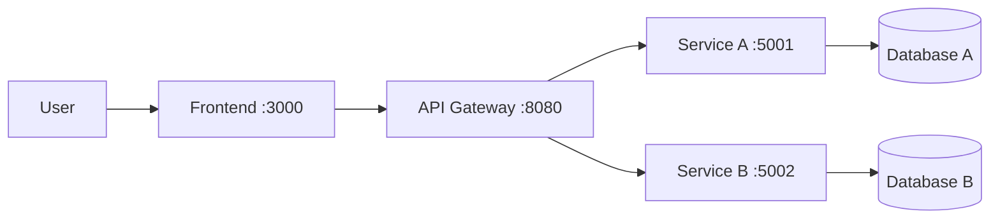

# Project Name

[](https://github.com/hungdn1701/microservices-assignment-starter/stargazers)
[](https://github.com/hungdn1701/microservices-assignment-starter/network/members)
[](LICENSE)

> Brief description of the business process being automated and the service-oriented solution.

> **New to this repo?** See [`GETTING_STARTED.md`](GETTING_STARTED.md) for setup instructions, workflow guide, and submission checklist.

---

## Team Members

| Name | Student ID | Role | Contribution |
|------|------------|------|-------------|
|      |            |      |             |

---

## Business Process

*(Summarize the **one business process** being automated — domain, actors, scope. Example: "Customer places an order and receives delivery in the Online Food Delivery domain.")*

---

## Architecture

*(Paste or update the architecture diagram from [`docs/architecture.md`](docs/architecture.md) here.)*



| Component     | Responsibility | Tech Stack | Port |
|---------------|----------------|------------|------|
| **Frontend**  |                |            | 3000 |
| **Gateway**   |                |            | 8080 |
| **Service A** |                |            | 5001 |
| **Service B** |                |            | 5002 |

---

## Quick Start

```bash
docker compose up --build
```

Verify: `curl http://localhost:8080/health/user`

### Container engine note (Traefik socket)

This project uses Traefik Docker provider, so the gateway container must mount a container-engine socket at `/var/run/docker.sock`.

- Docker (default): no extra env var needed.
- Podman: set `DOCKER_SOCKET_PATH=/run/user/1000/podman/podman.sock` (no `DOCKER_HOST` needed when you use real `podman compose`).

Recommended auto-detect command:

```bash
if command -v podman >/dev/null 2>&1; then
  DOCKER_SOCKET_PATH=/run/user/1000/podman/podman.sock podman compose up --build
else
  docker compose up --build
fi
```

Background: if Podman is used but `DOCKER_SOCKET_PATH` is not set, Traefik may start but cannot discover routes correctly because it reads the wrong socket path.

> For full setup instructions, prerequisites, and development commands, see [`GETTING_STARTED.md`](GETTING_STARTED.md).

---

## Documentation

| Document | Description |
|----------|-------------|
| [`GETTING_STARTED.md`](GETTING_STARTED.md) | Setup, workflow, submission checklist |
| [`docs/analysis-and-design.md`](docs/analysis-and-design.md) | Analysis & Design — Step-by-Step Action approach |
| [`docs/analysis-and-design-ddd.md`](docs/analysis-and-design-ddd.md) | Analysis & Design — Domain-Driven Design approach |
| [`docs/architecture.md`](docs/architecture.md) | Architecture patterns, components & deployment |
| [`docs/api-specs/`](docs/api-specs/) | OpenAPI 3.0 specifications for each service |

---

## License

This project uses the [MIT License](LICENSE).

> Template by [Hung Dang](https://github.com/hungdn1701) · [Template guide](GETTING_STARTED.md)
