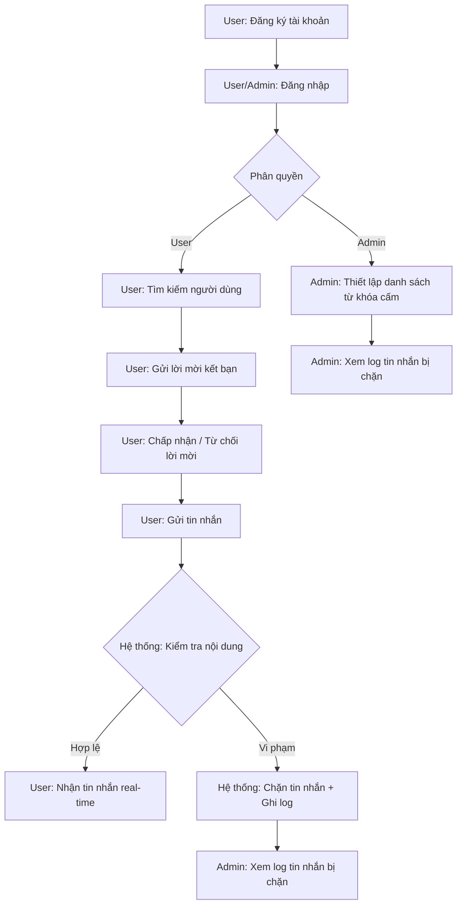
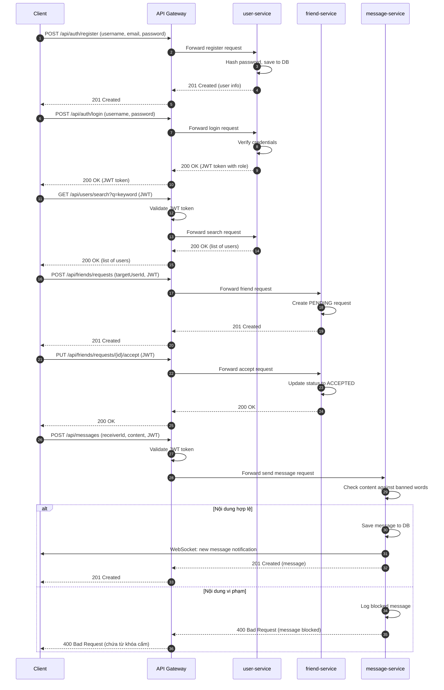
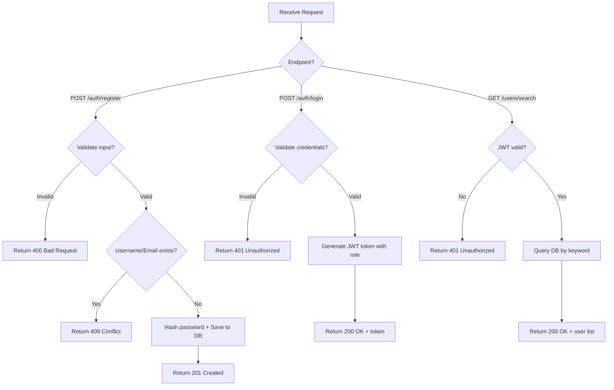

# Analysis and Design — Business Process Automation Solution

> **Goal**: Analyze a specific business process and design a service-oriented automation solution (SOA/Microservices).
> Scope: 4–6 week assignment — focus on **one business process**, not an entire system.

**References:**
1. *Service-Oriented Architecture: Analysis and Design for Services and Microservices* — Thomas Erl (2nd Edition)
2. *Microservices Patterns: With Examples in Java* — Chris Richardson
3. *Bài tập — Phát triển phần mềm hướng dịch vụ* — Hung Dang (available in Vietnamese)

---

## Part 1 — Analysis Preparation

### 1.1 Business Process Definition

- **Domain**: Nhắn tin 1-1 có kiểm duyệt nội dung
- **Business Process**: Người dùng đăng ký tài khoản, kết bạn và nhắn tin 1-1 trong hệ thống có kiểm duyệt nội dung tự động bằng từ khóa cấm
- **Actors**:
  - **User (Người dùng)**: Đăng ký tài khoản, đăng nhập, tìm kiếm và kết bạn với người dùng khác, gửi/nhận tin nhắn 1-1 real-time. User chịu ràng buộc bởi bộ lọc nội dung — tin nhắn chứa từ khóa cấm sẽ bị chặn.
  - **Admin (Quản trị viên)**: Đăng nhập với quyền quản trị, quản lý danh sách từ khóa cấm (thêm/xóa), giám sát hệ thống thông qua log các tin nhắn bị chặn.
- **Scope**:
  - **In-scope**: Đăng ký/đăng nhập (JWT), tìm kiếm người dùng, gửi/chấp nhận/từ chối lời mời kết bạn, nhắn tin 1-1 real-time (WebSocket), quản lý từ khóa cấm (CRUD), tự động lọc nội dung tin nhắn, ghi log và xem log tin nhắn bị chặn.
  - **Out-of-scope**: Nhắn tin nhóm, gọi thoại/video, gửi file/hình ảnh, thông báo đẩy (push notification), quản lý hồ sơ cá nhân nâng cao (avatar, bio), xóa tài khoản, quên mật khẩu, thanh toán.

**Process Diagram:**



**Process Steps:**

| # | Step | Actor | Mô tả |
|---|------|-------|--------|
| 1 | Đăng ký tài khoản | User | User nhập thông tin và tạo tài khoản mới |
| 2 | Đăng nhập | User / Admin | Xác thực vào hệ thống bằng username/password |
| 3 | Thiết lập danh sách từ khóa cấm | Admin | Admin thêm/sửa/xóa các từ khóa bị cấm trong hệ thống |
| 4 | Tìm kiếm người dùng | User | User tìm kiếm người dùng khác theo tên hoặc email |
| 5 | Gửi lời mời kết bạn | User | User gửi yêu cầu kết bạn đến người dùng tìm được |
| 6 | Chấp nhận / Từ chối lời mời | User | User phản hồi lời mời kết bạn nhận được |
| 7 | Gửi tin nhắn | User | User soạn và gửi tin nhắn đến bạn bè |
| 8 | Tin nhắn bị chặn (nếu vi phạm) | User | Hệ thống thông báo tin nhắn chứa từ khóa cấm, không gửi được |
| 9 | Nhận tin nhắn real-time | User | User nhận tin nhắn hợp lệ qua WebSocket |
| 10 | Xem log tin nhắn bị chặn | Admin | Admin xem danh sách các tin nhắn đã bị hệ thống chặn |

### 1.2 Existing Automation Systems

> None — the process is currently performed manually.

### 1.3 Non-Functional Requirements

Non-functional requirements serve as input for identifying Utility Service and Microservice Candidates in step 2.7.

| Requirement    | Description |
|----------------|-------------|
| Performance    | Tin nhắn phải được gửi/nhận real-time với độ trễ < 500ms thông qua WebSocket. Kiểm tra từ khóa cấm phải xử lý < 100ms mỗi tin nhắn. |
| Security       | Xác thực bằng JWT token. Mật khẩu được hash (bcrypt). Phân quyền USER/ADMIN. Chỉ Admin được truy cập API quản lý từ khóa cấm và xem log. |
| Scalability    | Mỗi microservice có thể scale độc lập. Message service cần scale nhiều hơn do tải cao nhất. |
| Availability   | Mỗi service có health check endpoint. Docker restart policy đảm bảo service tự khởi động lại khi lỗi. |

---

## Part 2 — REST/Microservices Modeling

### 2.1 Decompose Business Process & 2.2 Filter Unsuitable Actions

Decompose the process from 1.1 into granular actions. Mark actions unsuitable for service encapsulation.

| # | Action | Actor | Description | Suitable? |
|---|--------|-------|-------------|-----------|
| 1 | Nhập thông tin đăng ký | User | User điền form đăng ký (tên, email, mật khẩu) | ❌ — Thao tác thủ công trên UI |
| 2 | Tạo tài khoản người dùng | System | Lưu thông tin user vào database, hash mật khẩu | ✅ |
| 3 | Nhập thông tin đăng nhập | User / Admin | User hoặc Admin điền username và password | ❌ — Thao tác thủ công trên UI |
| 4 | Xác thực người dùng và cấp token | System | Kiểm tra credentials, cấp JWT token kèm role (USER/ADMIN) | ✅ |
| 5 | Lấy thông tin profile người dùng | System | Trả về thông tin cá nhân của user hiện tại | ✅ |
| 6 | Nhập từ khóa tìm kiếm | User | User nhập tên hoặc email vào ô tìm kiếm | ❌ — Thao tác thủ công trên UI |
| 7 | Tìm kiếm người dùng theo từ khóa | System | Query database theo tên hoặc email | ✅ |
| 8 | Gửi lời mời kết bạn | System | Tạo friend request từ user A đến user B (trạng thái PENDING) | ✅ |
| 9 | Lấy danh sách lời mời nhận được | System | Query các friend request có trạng thái PENDING gửi đến user | ✅ |
| 10 | Chấp nhận lời mời kết bạn | System | Cập nhật trạng thái friend request thành ACCEPTED | ✅ |
| 11 | Từ chối lời mời kết bạn | System | Cập nhật trạng thái friend request thành REJECTED | ✅ |
| 12 | Lấy danh sách bạn bè | System | Query tất cả friend relationships có trạng thái ACCEPTED | ✅ |
| 13 | Nhập từ khóa cấm | Admin | Admin điền từ/cụm từ cần cấm vào form | ❌ — Thao tác thủ công trên UI |
| 14 | Lưu từ khóa cấm vào hệ thống | System | Validate và lưu từ khóa cấm vào database | ✅ |
| 15 | Xóa từ khóa cấm khỏi hệ thống | System | Xóa từ khóa cấm khỏi database | ✅ |
| 16 | Truy vấn danh sách từ khóa cấm | System | Query tất cả từ khóa cấm từ database | ✅ |
| 17 | Soạn tin nhắn | User | User viết nội dung tin nhắn | ❌ — Thao tác thủ công trên UI |
| 18 | Lọc nội dung tin nhắn | System | Kiểm tra nội dung tin nhắn có chứa từ khóa cấm không | ✅ |
| 19 | Gửi tin nhắn hợp lệ | System | Lưu tin nhắn vào database và gửi đến người nhận | ✅ |
| 20 | Chặn tin nhắn vi phạm và ghi log | System | Từ chối gửi, ghi lại nội dung và lý do vào blocked log | ✅ |
| 21 | Gửi tin nhắn real-time qua WebSocket | System | Đẩy tin nhắn đến người nhận đang online qua WebSocket | ✅ |
| 22 | Lấy lịch sử tin nhắn | System | Query tin nhắn giữa 2 user, phân trang | ✅ |
| 23 | Truy vấn log tin nhắn bị chặn | System | Query danh sách tin nhắn đã bị chặn từ database | ✅ |

> Actions marked ❌: Thao tác thủ công trên giao diện (cả User lẫn Admin), không thể đóng gói thành service.

### 2.3 Entity Service Candidates

Identify business entities and group reusable (agnostic) actions into Entity Service Candidates.

| Entity | Service Candidate | Agnostic Actions |
|--------|-------------------|------------------|
| User | **user-service** | Tạo tài khoản (2), Xác thực và cấp token (4), Lấy profile (5), Tìm kiếm người dùng (7) |
| Friend | **friend-service** | Gửi lời mời (8), Lấy danh sách lời mời (9), Chấp nhận lời mời (10), Từ chối lời mời (11), Lấy danh sách bạn bè (12) |
| Message, BannedWord | **message-service** | Lọc nội dung (18), Gửi tin nhắn hợp lệ (19), Chặn và ghi log (20), Gửi real-time (21), Lấy lịch sử (22), Lưu từ khóa cấm (14), Xóa từ khóa cấm (15), Truy vấn từ khóa cấm (16), Truy vấn log bị chặn (23) |

### 2.4 Task Service Candidate

Group process-specific (non-agnostic) actions into a Task Service Candidate.

| Non-agnostic Action | Task Service Candidate |
|---------------------|------------------------|
| Điều phối đăng nhập → phân quyền → routing | **API Gateway** (đóng vai trò Task Service) |
| Xác thực JWT token trên mỗi request | **API Gateway** — middleware xác thực |
| Kiểm tra quyền ADMIN trước khi truy cập API quản trị | **API Gateway** — middleware phân quyền |

> API Gateway đảm nhận vai trò Task Service: điều phối request từ client đến đúng entity service, xác thực token và kiểm tra quyền trước khi forward.

### 2.5 Identify Resources

Map entities/processes to REST URI Resources.

| Entity / Process | Resource URI |
|------------------|--------------|
| User | `/api/users` |
| User Authentication | `/api/auth` |
| Friend Request | `/api/friends/requests` |
| Friend List | `/api/friends` |
| Message | `/api/messages` |
| Banned Word | `/api/moderation/banned-words` |
| Blocked Message Log | `/api/moderation/blocked-logs` |

### 2.6 Associate Capabilities with Resources and Methods

| Service Candidate | Capability | Resource | HTTP Method |
|-------------------|------------|----------|-------------|
| user-service | Đăng ký tài khoản | `/api/auth/register` | POST |
| user-service | Đăng nhập | `/api/auth/login` | POST |
| user-service | Lấy profile hiện tại | `/api/users/me` | GET |
| user-service | Tìm kiếm user | `/api/users/search?q={keyword}` | GET |
| friend-service | Gửi lời mời kết bạn | `/api/friends/requests` | POST |
| friend-service | Lấy lời mời nhận được | `/api/friends/requests/received` | GET |
| friend-service | Chấp nhận lời mời | `/api/friends/requests/{id}/accept` | PUT |
| friend-service | Từ chối lời mời | `/api/friends/requests/{id}/reject` | PUT |
| friend-service | Lấy danh sách bạn bè | `/api/friends` | GET |
| message-service | Gửi tin nhắn (kèm lọc nội dung) | `/api/messages` | POST |
| message-service | Lấy lịch sử tin nhắn | `/api/messages/{userId}` | GET |
| message-service | Nhận tin nhắn real-time | `/ws/messages` | WebSocket |
| message-service | Thêm từ khóa cấm | `/api/moderation/banned-words` | POST |
| message-service | Xóa từ khóa cấm | `/api/moderation/banned-words/{id}` | DELETE |
| message-service | Xem danh sách từ khóa cấm | `/api/moderation/banned-words` | GET |
| message-service | Xem log tin nhắn bị chặn | `/api/moderation/blocked-logs` | GET |

### 2.7 Utility Service & Microservice Candidates

Based on Non-Functional Requirements (1.3) and Processing Requirements, identify cross-cutting utility logic or logic requiring high autonomy/performance.

| Candidate | Type (Utility / Microservice) | Justification |
|-----------|-------------------------------|---------------|
| Authentication & Authorization (JWT) | Utility (trong API Gateway) | Cross-cutting concern: mọi request đều cần xác thực. Xử lý tại gateway để các service không cần duplicate logic auth. |
| Content Filter | Microservice (trong message-service) | Yêu cầu performance cao (< 100ms mỗi tin nhắn). Cần scale độc lập theo tải messaging. Logic lọc nội dung gắn chặt với message processing. |
| WebSocket Notification | Microservice (trong message-service) | Yêu cầu availability cao và real-time. Stateful connection cần quản lý riêng. |

### 2.8 Service Composition Candidates

Interaction diagram showing how Service Candidates collaborate to fulfill the business process.



---

## Part 3 — Service-Oriented Design

> Part 3 is the **convergence point** — regardless of whether you used Step-by-Step Action or DDD in Part 2, the outputs here are the same: service contracts and service logic.

### 3.1 Uniform Contract Design

Service Contract specification for each service. Full OpenAPI specs:
- [`docs/api-specs/user-service.yaml`](api-specs/user-service.yaml)
- [`docs/api-specs/friend-service.yaml`](api-specs/friend-service.yaml)
- [`docs/api-specs/message-service.yaml`](api-specs/message-service.yaml)

**User service:**

| Endpoint | Method | Description | Request Body | Response Codes |
|----------|--------|-------------|--------------|----------------|
| `/health` | GET | Health check | — | 200 |
| `/api/auth/register` | POST | Đăng ký tài khoản mới | `{ username, email, password }` | 201, 400, 409 |
| `/api/auth/login` | POST | Đăng nhập | `{ username, password }` | 200, 401 |
| `/api/users/me` | GET | Lấy profile user hiện tại (JWT required) | — | 200, 401 |
| `/api/users/search` | GET | Tìm kiếm user theo tên/email (JWT required) | Query: `?q={keyword}` | 200, 401 |

**Friend Service:**

| Endpoint | Method | Description | Request Body | Response Codes |
|----------|--------|-------------|--------------|----------------|
| `/health` | GET | Health check | — | 200 |
| `/api/friends/requests` | POST | Gửi lời mời kết bạn (JWT required) | `{ targetUserId }` | 201, 400, 409 |
| `/api/friends/requests/received` | GET | Lấy danh sách lời mời nhận được (JWT required) | — | 200, 401 |
| `/api/friends/requests/{id}/accept` | PUT | Chấp nhận lời mời (JWT required) | — | 200, 404 |
| `/api/friends/requests/{id}/reject` | PUT | Từ chối lời mời (JWT required) | — | 200, 404 |
| `/api/friends` | GET | Lấy danh sách bạn bè (JWT required) | — | 200, 401 |

**Message service:**

| Endpoint | Method | Description | Request Body | Response Codes |
|----------|--------|-------------|--------------|----------------|
| `/health` | GET | Health check | — | 200 |
| `/api/messages` | POST | Gửi tin nhắn (JWT required, tự động lọc nội dung) | `{ receiverId, content }` | 201, 400, 403 |
| `/api/messages/{userId}` | GET | Lấy lịch sử tin nhắn với 1 user (JWT required) | Query: `?page=1&limit=50` | 200, 401 |
| `/ws/messages` | WebSocket | Kết nối WebSocket nhận tin nhắn real-time | — | — |
| `/api/moderation/banned-words` | GET | Xem danh sách từ khóa cấm (ADMIN only) | — | 200, 403 |
| `/api/moderation/banned-words` | POST | Thêm từ khóa cấm (ADMIN only) | `{ word }` | 201, 400, 409 |
| `/api/moderation/banned-words/{id}` | DELETE | Xóa từ khóa cấm (ADMIN only) | — | 200, 404 |
| `/api/moderation/blocked-logs` | GET | Xem log tin nhắn bị chặn (ADMIN only) | Query: `?page=1&limit=50` | 200, 403 |

### 3.2 Service Logic Design

Internal processing flow for each service.

**User service:**



**Friend service:**

```mermaid
flowchart TD
    A[Receive Request] --> B{JWT valid?}
    B -->|No| B1[Return 401 Unauthorized]
    B -->|Yes| C{Endpoint?}

    C -->|POST /friends/requests| D{Request already exists?}
    D -->|Yes| D1[Return 409 Conflict]
    D -->|No| D2[Create PENDING request]
    D2 --> D3[Return 201 Created]

    C -->|PUT /requests/{id}/accept| E{Request exists + belongs to user?}
    E -->|No| E1[Return 404 Not Found]
    E -->|Yes| E2[Update status → ACCEPTED]
    E2 --> E3[Return 200 OK]

    C -->|PUT /requests/{id}/reject| F{Request exists + belongs to user?}
    F -->|No| F1[Return 404 Not Found]
    F -->|Yes| F2[Update status → REJECTED]
    F2 --> F3[Return 200 OK]

    C -->|GET /friends| G[Query ACCEPTED relationships]
    G --> G1[Return 200 OK + friend list]
```

**Message service:**

```mermaid
flowchart TD
    A[Receive Request] --> B{JWT valid?}
    B -->|No| B1[Return 401 Unauthorized]
    B -->|Yes| C{Endpoint?}

    C -->|POST /messages| D[Load banned words from DB]
    D --> E{Content contains banned word?}
    E -->|Yes| F[Save to blocked_logs table]
    F --> F1[Return 400 Bad Request - message blocked]
    E -->|No| G[Save message to DB]
    G --> H[Send via WebSocket to receiver]
    H --> I[Return 201 Created]

    C -->|GET /messages/{userId}| J[Query messages between 2 users]
    J --> J1[Return 200 OK + message history]

    C -->|POST /moderation/banned-words| K{Role = ADMIN?}
    K -->|No| K1[Return 403 Forbidden]
    K -->|Yes| K2{Word already exists?}
    K2 -->|Yes| K3[Return 409 Conflict]
    K2 -->|No| K4[Save to DB]
    K4 --> K5[Return 201 Created]

    C -->|GET /moderation/blocked-logs| L{Role = ADMIN?}
    L -->|No| L1[Return 403 Forbidden]
    L -->|Yes| L2[Query blocked logs from DB]
    L2 --> L3[Return 200 OK + blocked logs]
```
