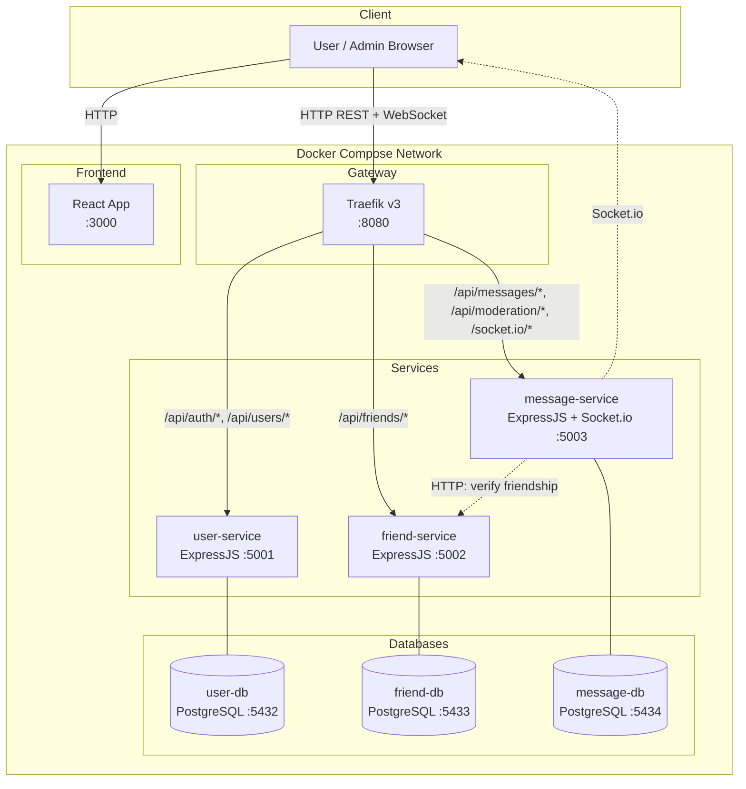

# System Architecture

> This document is completed **after** the Analysis and Design phase.
> Choose **one** analysis approach and complete it first:
> - [Analysis and Design — Step-by-Step Action](analysis-and-design.md)
> - [Analysis and Design — DDD](analysis-and-design-ddd.md)
>
> Both approaches produce the same inputs for this document: **Service Candidates**, **Service Composition**, and **Non-Functional Requirements**.

**References:**
1. *Service-Oriented Architecture: Analysis and Design for Services and Microservices* — Thomas Erl (2nd Edition)
2. *Microservices Patterns: With Examples in Java* — Chris Richardson
3. *Bài tập — Phát triển phần mềm hướng dịch vụ* — Hung Dang (available in Vietnamese)

---

### How this document connects to Analysis & Design

```
┌─────────────────────────────────────────────────────┐
│         Analysis & Design (choose one)              │
│                                                     │
│  Step-by-Step Action        DDD                     │
│  Part 1: Analysis Prep     Part 1: Domain Discovery │
│  Part 2: Decompose →       Part 2: Strategic DDD →  │
│    Service Candidates        Bounded Contexts       │
│  Part 3: Service Design    Part 3: Service Design   │
│    (contract + logic)        (contract + logic)     │
└────────────────┬────────────────────────────────────┘
                 │ inputs: service list, NFRs,
                 │         service contracts (API specs)
                 ▼
┌─────────────────────────────────────────────────────┐
│         Architecture (this document)                │
│                                                     │
│  1. Pattern Selection                               │
│  2. System Components (tech stack, ports)           │
│  3. Communication Matrix                            │
│  4. Architecture Diagram                            │
│  5. Deployment                                      │
└─────────────────────────────────────────────────────┘
```

> 💡 **What you need before starting:** your completed service list from Part 2 (service candidates and their responsibilities) and your service contracts from Part 3 (API endpoints). This document turns those logical designs into a concrete, deployable system architecture.

---

## 1. Pattern Selection

Select patterns based on business/technical justifications from your analysis.

| Pattern | Selected? | Business/Technical Justification |
|---------|-----------|----------------------------------|
| API Gateway | ✅ | Traefik đóng vai trò single entry point, reverse proxy, routing dựa trên path prefix. Xử lý cross-cutting concerns: TLS termination, load balancing. JWT authentication được xử lý tại mỗi service thông qua middleware chung (shared library). |
| Database per Service | ✅ | Mỗi service (user, friend, message) có PostgreSQL database riêng, đảm bảo loose coupling và independent deployability. Thay đổi schema của service này không ảnh hưởng service khác. |
| Shared Database | ❌ | Không sử dụng — vi phạm nguyên tắc service autonomy. Nếu dùng shared DB, thay đổi schema ảnh hưởng tất cả services. |
| Saga | ❌ | Không cần — không có distributed transaction phức tạp. Gửi tin nhắn chỉ cần message-service gọi friend-service kiểm tra bạn bè (synchronous call), không cần compensating transaction. |
| Event-driven / Message Queue | ❌ | Không sử dụng trong phạm vi hiện tại. Real-time messaging dùng Socket.io (WebSocket) thay vì message broker. Có thể bổ sung RabbitMQ/Kafka trong tương lai nếu cần async inter-service communication. |
| CQRS | ❌ | Không cần — read/write patterns của hệ thống đơn giản, không có yêu cầu tách biệt read model và write model. |
| Circuit Breaker | ❌ | Không áp dụng trong phạm vi MVP. Có thể bổ sung khi scale (ví dụ: message-service gọi friend-service fail → fallback). |
| Service Registry / Discovery | ❌ | Docker Compose DNS đã cung cấp service discovery tự động. Các service gọi nhau qua tên container (ví dụ: `http://friend-service:5002`). Không cần Consul/Eureka cho deployment đơn giản. |

> Reference: *Microservices Patterns* — Chris Richardson, chapters on decomposition, data management, and communication patterns.

---

## 2. System Components

| Component | Responsibility | Tech Stack | Port |
|-----------|---------------|------------|------|
| **Frontend** | Giao diện người dùng: đăng ký, đăng nhập, tìm kiếm bạn bè, nhắn tin real-time, quản lý từ khóa cấm (Admin) | ReactJS | 3000 |
| **Gateway** | Reverse proxy, routing request đến đúng service dựa trên path prefix, load balancing, health check monitoring | Traefik v3 | 8080 (HTTP), 8081 (Dashboard) |
| **user-service** | Đăng ký, đăng nhập (JWT), lấy profile, tìm kiếm người dùng | ExpressJS (Node.js) | 5001 |
| **friend-service** | Gửi/chấp nhận/từ chối lời mời kết bạn, lấy danh sách bạn bè | ExpressJS (Node.js) | 5002 |
| **message-service** | Gửi/nhận tin nhắn (kèm kiểm tra bạn bè + lọc nội dung), WebSocket (Socket.io), quản lý từ khóa cấm | ExpressJS (Node.js) + Socket.io | 5003 |
| **user-db** | Lưu trữ dữ liệu users (tài khoản, credentials) | PostgreSQL 18 | 5432 |
| **friend-db** | Lưu trữ dữ liệu friend requests và relationships | PostgreSQL 18 | 5433 |
| **message-db** | Lưu trữ dữ liệu messages và banned words | PostgreSQL 18 | 5434 |

---

## 3. Communication

### Inter-service Communication Matrix

| From → To | Frontend | Gateway (Traefik) | user-service | friend-service | message-service | user-db | friend-db | message-db |
|-----------|----------|-------------------|--------------|----------------|-----------------|---------|-----------|------------|
| **Frontend** | — | HTTP REST, WebSocket | — | — | — | — | — | — |
| **Gateway** | — | — | HTTP REST (reverse proxy) | HTTP REST (reverse proxy) | HTTP REST + WebSocket (reverse proxy) | — | — | — |
| **user-service** | — | — | — | — | — | TCP (pg) | — | — |
| **friend-service** | — | — | — | — | — | — | TCP (pg) | — |
| **message-service** | WebSocket (Socket.io) | — | — | HTTP REST (verify friendship) | — | — | — | TCP (pg) |

### Communication Protocols

| Protocol | Usage | Description |
|----------|-------|-------------|
| HTTP/REST | Client ↔ Gateway ↔ Services | Synchronous request/response cho tất cả API endpoints |
| WebSocket (Socket.io) | Client ↔ message-service | Real-time bidirectional communication cho nhận tin nhắn. Socket.io cung cấp tự động fallback polling nếu WS không khả dụng |
| TCP | Services ↔ Databases | PostgreSQL wire protocol, kết nối qua connection pool |

### Traefik Routing Rules

| Path Prefix | Target Service | Strip Prefix? |
|-------------|---------------|---------------|
| `/api/auth/*` | user-service:5001 | No |
| `/api/users/*` | user-service:5001 | No |
| `/api/friends/*` | friend-service:5002 | No |
| `/api/messages/*` | message-service:5003 | No |
| `/api/moderation/*` | message-service:5003 | No |
| `/socket.io/*` | message-service:5003 | No |

---

## 4. Architecture Diagram

> Place diagrams in `docs/asset/` and reference here.



> **Ghi chú:**
> - Đường nét liền (→) = synchronous HTTP request
> - Đường nét đứt (-.->)  = inter-service call hoặc WebSocket
> - Frontend (React) được serve qua Traefik hoặc trực tiếp qua port 3000

---

## 5. Deployment

### Containerization

- Tất cả services được containerize bằng **Docker**
- Orchestration bằng **Docker Compose**
- Single command: `docker compose up --build`

### Docker Compose Services

| Service | Image / Build | Depends On | Restart Policy |
|---------|--------------|------------|----------------|
| traefik | `traefik:v3.0` | — | `unless-stopped` |
| frontend | Build `./frontend` | traefik | `unless-stopped` |
| user-service | Build `./services/user-service` | user-db | `unless-stopped` |
| friend-service | Build `./services/friend-service` | friend-db | `unless-stopped` |
| message-service | Build `./services/message-service` | message-db | `unless-stopped` |
| user-db | `postgres:18` | — | `unless-stopped` |
| friend-db | `postgres:18` | — | `unless-stopped` |
| message-db | `postgres:18` | — | `unless-stopped` |

### Environment Variables

| Variable | Service | Description |
|----------|---------|-------------|
| `DATABASE_URL` | user/friend/message-service | PostgreSQL connection string |
| `JWT_SECRET` | user/friend/message-service | Shared secret cho JWT token verification |
| `PORT` | all services | Port mà service lắng nghe |
| `FRIEND_SERVICE_URL` | message-service | URL nội bộ đến friend-service (ví dụ: `http://friend-service:5002`) |

### Health Checks

Mỗi service expose `GET /health` → `{ "status": "ok" }`. Traefik sử dụng endpoint này để kiểm tra service availability và tự động routing chỉ đến healthy instances.

### Network

Tất cả containers cùng chung một Docker Compose network (`chatapp-network`), cho phép giao tiếp nội bộ qua tên service (Docker DNS).
